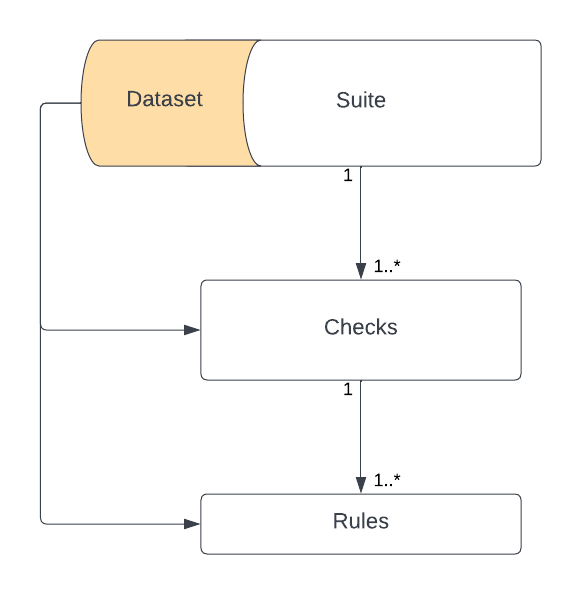
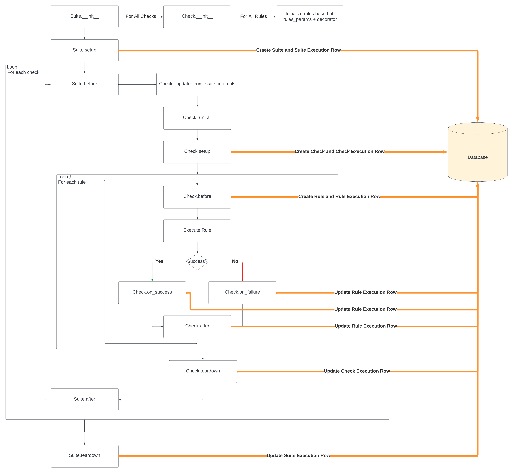

# data_checks 
  

**Program and execute any data quality checks.**

## Overview
Exisiting data observability solutions are painfully static. data_checks provides a dynamic data observability framework that allows you to program and execute any data quality checks. Inspired by Python's [unittest](https://docs.python.org/3/library/unittest.html) approach to writing unittests, data_checks allows you to write data quality checks as easily and seamlessly as you would write unittests on your code.

Some reason you might use this library:
- Use existing Python functions in data checks
- Greater control over how data checks are defined and executed
- Infinitely extendible and customizable for any data quality use case
- Built-in async execution of data checks
- Connect any database to store data related to checks and executions
- **[WIP]** Define before, after, on success and on failure actions based on data checks
- **[WIP]** Automatically generate data checks from the command line (as you would generate a database migration) and Jupyter Notebooks

## Architecture
This library defines 3 core concepts: suites, checks, and rules. Suites are a collection of checks and/or rules. Checks are groups of organized rules that can be selectively executed. Rule are the atomic unit of this data check library and consist of functions that run a series of assertions on incoming data. **In the current version, rules need to be defined within checks. This will be changed in a later version of the library.** Rules are the fundamental building block of data checks — every other component in this library is built on top of rules and adds additional functionality around these checks. Furthermore note that a Dataset defined in a suite and/or check can be accessed by its children rules.


The execution flow of a suite of data checks goes as follows:



## Getting Started
In this tutorial, we will walk through how to define a suite of data checks, execute them, and view the results. Assume that we're an international organization called Team Rocketwhose mission is to capture as many Pokémon as possible. The organization is growing very rapidly and our data is growing at an exponential rate. We have the following datasets:

`pokemon_captures`: A table that contains information about the Pokémon that we've captured.
| Pokemon ID | Species        | Capture Date | Location       | Capturing Agent |
|------------|----------------|--------------|----------------|-----------------|
| 001        | Bulbasaur     | 2023-03-15   | Viridian Forest| Ash Ketchum    |
| 025        | Pikachu       | 2023-04-02   | Pallet Town    | Misty Waterflower |
| 133        | Eevee         | 2023-04-10   | Celadon City   | Brock Rockwell |
| 152        | Chikorita     | 2023-04-20   | Johto Forest   | Ethan Gold     |
| 255        | Torchic       | 2023-05-05   | Littleroot Town| May Maple      |
| 387        | Turtwig       | 2023-05-15   | Sandgem Town   | Lucas Diamond  |
| ...        | ...           | ...          | ...            | ...             |

`trainer_performance`: A table that contains information about the performance of our trainers.
| Agent ID | Name            | Age | Hometown     | Total Captures | First Capture Date | Last Capture Date |
|----------|-----------------|-----|--------------|----------------|-------------------|------------------|
| 001      | Ash Ketchum    | 16  | Pallet Town  | 350            | 2022-01-10        | 2023-08-05       |
| 002      | Misty Waterflower | 18 | Cerulean City | 240           | 2022-02-20        | 2023-07-30       |
| 003      | Brock Rockwell  | 20  | Pewter City  | 180            | 2022-03-15        | 2023-07-25       |
| 004      | Ethan Gold     | 17  | New Bark Town | 220           | 2022-01-25        | 2023-08-01       |
| 005      | May Maple      | 16  | Petalburg City| 190           | 2022-02-10        | 2023-07-28       |
| 006      | Lucas Diamond  | 18  | Twinleaf Town | 210           | 2022-03-05        | 2023-07-29       |
| ...      | ...             | ... | ...          | ...            | ...               | ...              |

<!-- Missing bonus information.
Invalid bonus IDs or trainer IDs.
Negative bonus amounts.
Inconsistent date formats.
Unrecognized bonus reasons. -->

`pokemon_sales`: A table that contains information about the sales of Pokémon.
| Sale ID | Pokemon ID | Sale Date  | Sale Price (USD) | Buyer         | Seller       | Location      | Transaction Type | Payment Method |
|---------|------------|------------|------------------|---------------|--------------|---------------|------------------|----------------|
| 001     | 025        | 2023-03-15 | 50               | Trainer A     | Trainer B    | Pallet Town   | In-Person       | Cash           |
| 002     | 133        | 2023-04-02 | 30               | Trainer C     | Trainer D    | Celadon City | Online           | Credit Card    |
| 003     | 387        | 2023-04-10 | 40               | Trainer E     | Trainer F    | Sandgem Town  | In-Person       | Cash           |
| 004     | 152        | 2023-05-20 | 45               | Trainer G     | Trainer H    | Johto Forest  | Online           | PayPal         |
| 005     | 255        | 2023-06-05 | 35               | Trainer I     | Trainer J    | Littleroot Town| In-Person      | Cash           |
| 006     | 001        | 2023-07-15 | 60               | Trainer K     | Trainer L    | Pallet Town   | Online           | Credit Card    |
| ...     | ...        | ...        | ...              | ...           | ...          | ...           | ...              | ...            |

Missing sale information.
Inconsistent Pokémon IDs.
Invalid sale prices (e.g., negative price).
Misspelled buyer/seller names.
Duplicate sale IDs.
Inconsistent date formats.
Out-of-range or future sale dates.

`trainer_carbon_outputs`: A table that contains information about the carbon output of our trainers.
| Bonus ID | Trainer ID | Bonus Amount (USD) | Bonus Date  | Reason                | Location       |
|----------|------------|--------------------|-------------|-----------------------|----------------|
| 001      | 001        | 500                | 2023-03-15  | Top Performer         | Indigo Plateau |
| 002      | 002        | 300                | 2023-04-02  | Team Collaboration    | Cerulean City |
| 003      | 003        | 400                | 2023-04-10  | Environmental Efforts | Pewter City   |
| 004      | 004        | 250                | 2023-05-20  | Innovation            | Goldenrod City|
| 005      | 005        | 280                | 2023-06-05  | Community Engagement  | Petalburg City|
| 006      | 006        | 320                | 2023-07-15  | Special Achievement   | Sandgem Town  |
| ...      | ...        | ...                | ...         | ...                   | ...            |

Missing trainer information.
Invalid trainer IDs.
Negative carbon output values.
Inconsistent date formats.
Out-of-range or future join/update dates.


As the chief data officer, you want to ensure that the data in these tables is accurate and up-to-date. You want to write some data quality checks for this very reason. We will 

### 0. Instantiate the Database
Before importing the data_checks library, you need to instantiate the database. This database will be used to store information about the checks and their executions. The database can be any database supported by SQLAlchemy. In this example, we will use a PostgreSQL database. Inside our data checks repository (`data_quality/`) define a `__init__.py` file and instantiate the database as follows:

```python


<!-- ```python
from data_checks import Suite -->
## Features
### Suites
### Checks
### Rules
### Dataset
### Database
### Data Check Exceptions
## Requirements
- Python 3.6+
- SQLAlchemy 2.0+
- typing_extensions 4.7+
## Installation
```shell 
pip install -i https://test.pypi.org/simple/ data-checks -U
```